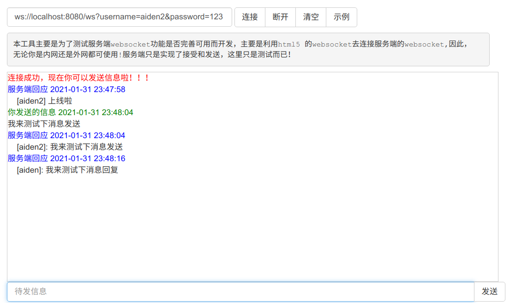
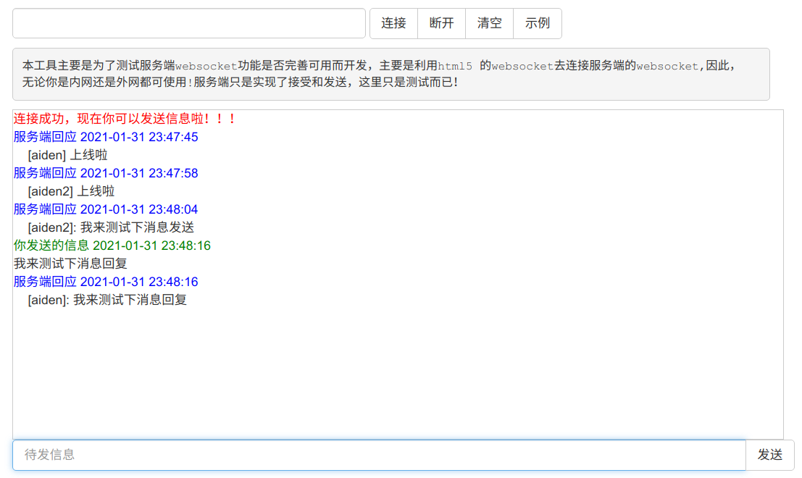

#### 一个简单、基于 springboot websocket 的 demo

##### 依赖
- maven
- jdk11
- redis

###### redis 配置
redis 默认使用 localhost:6379。如果需要修改 host:port，可以修改 application.yml
 
redis 仅仅用于存储用户 username / password

##### 使用
###### 服务端启动
启动后，会监听 localhost:8080 端口
 
其中，websocket url 为 ws:localhost:8080/ws
 
获取在线用户数接口为 http://localhost:8080/session/count

###### 前端测试
可以使用 http://coolaf.com/tool/chattest
 
由于有简单的帐号体系，链接时需要制定 username / password，若 username 不存在，则直接注册成功；否则会判断 username / password 是否匹配
 
如 ws://localhost:8080/ws?username=aiden&password=123 才能进行连接
图示：

 
 

