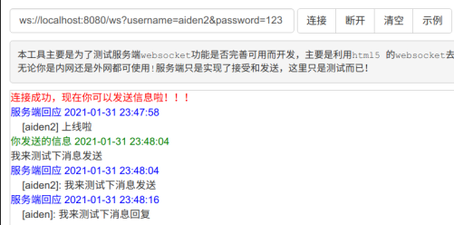

## 基于 springboot websocket 的群聊实现

#### 功能列表
- 分布式
- 同一帐号多设备登录
- 群聊
- 多设备
- 简单鉴权
- 心跳检查

#### 依赖
- maven
- jdk11
- redis

#### redis 配置
redis 默认使用 localhost:6379。如果需要修改 host:port，可以修改 application.yml
<br/>
redis 仅仅用于存储用户 username / password

#### 源码分析
###### [Auth 过程](https://github.com/yemingfeng/jchat-server/blob/master/src/main/java/com/jchat/interceptor/AuthorizationInterceptor.java)
```java
String username = ((ServletServerHttpRequest) request)
  .getServletRequest().getParameter(USERNAME);
String password = ((ServletServerHttpRequest) request)
  .getServletRequest().getParameter(PASSWORD);
User user = userService.register(username, password);
// 将 user 设置到 attributes 中
attributes.put(USER, user);
return true;
```

###### [连接创建](https://github.com/yemingfeng/jchat-server/blob/master/src/main/java/com/jchat/listener/SessionEstablishedEventListener.java)
```java
// 1. 添加 session
sessionService.add(session);
// 2. 按 username + sessionId 生成 redis key，并进行订阅，这样做可以支持多设备同一个帐号登录
MessageListener messageListener = (message, pattern) -> {
  log.info("Redis sub receive: [{}]", new String(message.getBody()));
  try {
    session.sendMessage(new TextMessage(message.getBody()));
  } catch (IOException e) {
    log.error("", e);
  }
};
redisMessageListenerContainer.addMessageListener(messageListener,
  new ChannelTopic(genSubKey(session)));
// 由于 session 会断开，需要保存下来，以待 removeListener
messageListenerMap.put(session, messageListener);
```

##### [监听消息](https://github.com/yemingfeng/jchat-server/blob/master/src/main/java/com/jchat/listener/TextMessageEventListener.java)
```java
// 获取所有在线的 session，然后通过 redis pub 功能转发消息
sessionService.getSessions()
  .forEach(session -> pubSubService.pub(session, textMessage));
```

##### [心跳检查](https://github.com/yemingfeng/jchat-server/blob/master/src/main/java/com/jchat/service/impl/HeartbeatServiceImpl.java)
```java
// 核心逻辑是使用分桶策略，一共有 10 个桶，每个桶有对应的定时任务和延迟队列
// 延迟队列使用了 HeartbeatSessionTask， 其中 HeartbeatSessionTask 封装了 session 和对应的过期时间

static final int BUCKET_SIZE = 10;

// 每个 session 进入桶时，会根据 sessionId.hashCode() & BUCKET_SIZE 选择桶
bucket[Math.abs(session.getId().hashCode() % BUCKET_SIZE)].add(new HeartbeatSessionTask(session));

// 启动每个桶的定时任务
for (int i = 0; i < BUCKET_SIZE; i++) {
  bucket[i] = new DelayQueue<>();
  executors[i] = Executors.newSingleThreadExecutor();
  int index = i;

  executors[index].submit(() -> {
    while (true) {
      try {
        HeartbeatSessionTask task;
        while ((task = bucket[index].poll()) != null) {
          task.getSession().close();
          log.warn("[{}] is dead, so close", SessionUtil.getUsernameFromSession(task.session));
        }
      } catch (Exception e) {
        log.error("", e);
      }
      Thread.sleep(TimeUnit.SECONDS.toMillis(1));
    }
  });
}
```

#### 使用
###### 服务端启动
启动后，会监听 localhost:8080 端口
<br/>
其中，websocket url 为 ws:localhost:8080/ws
<br/>
获取在线用户数接口为 http://localhost:8080/session/page

###### [shell 测试](https://www.npmjs.com/package/wscat)
使用 wscat 测试
```
wscat -c 'ws://localhost:8080/ws?username=aiden&password=123'
```

###### [前端测试](http://coolaf.com/tool/chattest)
由于有简单的帐号体系，链接时需要制定 username / password，若 username 不存在，则直接注册成功；否则会判断 username / password 是否匹配
<br/>
如 ws://localhost:8080/ws?username=aiden&password=123 才能进行连接
图示：

